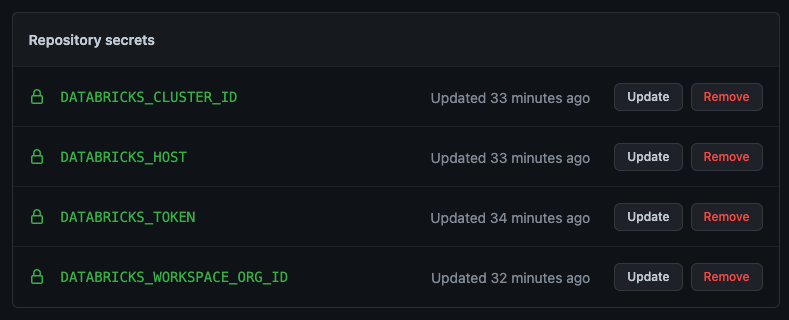

# Introduction

The code in this repository provides sample PySpark functions and sample PyTest unit tests. 

# Setting up 

<details>
<summary><strong> Step 1: Create your python environment </strong></summary>

Using conda, you can create your python environment by running: 
```
conda create -n <name_of_your_env> python=3.8
```

And activating by: 
```
conda activate <name_of_your_env> 
```

Note: 
- We are using `python=3.8` because the newest version of Databricks requires python 3.8

</details>

<details>
<summary><strong> Step 2: Install dependencies </strong></summary>

Using pip, you can install all dependencies by running: 

```
pip install -r requirements.txt 
```

Note: 
- This installs all dependencies listed in the `requirements.txt` file located at the root of this repository. 

</details>

<details>
<summary><strong> Step 3: Create your Databricks Cluster </strong></summary>

For this demo, please create a Databricks Cluster with Runtime `9.1 LTS`. See instructions on how to create a cluster here: https://docs.databricks.com/clusters/create.html

Databricks runtime 9.1 LTS allows us to use features such as files and modules in Repos, thus allowing us to modularise our code. The selected Databricks runtime version must match the Python version you have installed on your local machine. For this demo, Python 3.8 is compatible with Databricks Runtime 9.1 LTS. For all version mappings, see: https://docs.databricks.com/dev-tools/databricks-connect.html#requirements

</details>

<details>
<summary><strong> Step 4: Configure Databricks Connect </strong></summary>

Databricks connect allows you to run PySpark code on your local machine on a Databricks Cluster. 

To configure the connection, run: 

```
databricks-connect configure
```

You will be prompted for the following information: 
- Databricks Host
- Databricks Token
- Cluster ID 
- Org ID 
- Port 

You can obtain all the necessary information by navigating to your Cluster in your Databricks Workspace and referring to the URL. 

For example: 
- Full URL: `https://dbc-12345.cloud.databricks.com/?o=987654321#setting/clusters/my-987-cluster/configuration`
    - Databricks Host: `https://dbc-12345.cloud.databricks.com`
    - Databricks Token: see instructions on how to generate your databricks token here: https://docs.databricks.com/dev-tools/api/latest/authentication.html
    - Cluster ID: `my-987-cluster` 
    - Org ID: `987654321`
    - Port: `15001` (leave as default)

</details>

<details>
<summary><strong> Step 5: Validate Databricks Connect </strong></summary>

Validate that you are able to achieve Databricks Connect connectivity from your local machine by running: 

```
databricks-connect test
```

You should see the following response (below is shortened): 
```
* Simple Scala test passed
* Testing python command
* Simple PySpark test passed
* Testing dbutils.fs
* Simple dbutils test passed
* All tests passed.
```

</details>

# Unit tests 

Unit tests are performed using PyTest on your local development environment. These same tests can be executed as part of a CI/CD pipeline so that code is always tested before merging into the production branch (e.g. `main`). 

<details>
<summary><strong>Writing tests</strong></summary>

To understand how to write unit tests, refer to the two files below: 

`functions/cleaning_utils.py`
```python
def lowercase_all_column_names(df:DataFrame)->DataFrame:
    """
    Convert all column names to lower case. 
    """
    for col in df.columns:
        df = df.withColumnRenamed(col, col.lower())
    return df 
```


The code above is a PySpark function that accepts a Spark DataFrame, performs some cleaning/transformation, and returns a Spark DataFrame. 

We want to be able to perform unit testing on the PySpark function to ensure that the results returned are as expected, and changes to it won't break our expectations. 

To test this PySpark function, we write the following unit test: 

`functions/tests/test_cleaning_utils.py`
```python
from pyspark.sql import Row, SparkSession
import pandas as pd
from datetime import datetime
from ..cleaning_utils import *

def test_lowercase_all_columns():
    # ASSEMBLE
    test_data = [
        {
            "ID": 1,
            "First_Name": "Bob",
            "Last_Name": "Builder",
            "Age": 24
        },
        {
            "ID": 2,
            "First_Name": "Sam",
            "Last_Name": "Smith",
            "Age": 41
        }
    ]

    spark = SparkSession.builder.getOrCreate()
    test_df = spark.createDataFrame(map(lambda x: Row(**x), test_data))

    # ACT 
    output_df = lowercase_all_column_names(test_df)

    output_df_as_pd = output_df.toPandas()

    expected_output_df = pd.DataFrame({
        "id": [1, 2],
        "first_name": ["Bob", "Sam"],
        "last_name": ["Builder", "Smith"],
        "age": [24, 41]
    })
    # ASSERT
    pd.testing.assert_frame_equal(left=expected_output_df,right=output_df_as_pd, check_exact=True)
```

The test above does 3 things: 

1. **Arrange**: Create dummy Spark DataFrame. 
2. **Act**: Invoke our PySpark Function and passes in our dummy Spark DataFrame.
3. **Assert**: Check that the data returned matches our expectation after the transformation. The result should be a pass/fail.

When developing your tests, you may wish to run your test_.py file to validate that the code can be executed. You can do so by doing: 
```
python -m functions.tests.test_cleaning_utils
```


The benefit of using PyTest is that the results of our testing can be exported into the JUnit XML format, which is a standard test output format that is used by GitHub, Azure DevOps, GitLab, and many more, as a supported Test Report format. 

</details>

<details>
<summary><strong>Running tests</strong></summary>
To run all tests in the functions folder, run: 

```
pytest functions
```

You should see the following output: 
```
======= test session starts =======
collected 3 items   
functions/tests/test_cleaning_utils.py ...   [100%]
======= 3 passed in 16.40s =======
```
</details>

# Continuous Integration (CI)

<details>
<summary><strong>GitHub Actions</strong></summary>

To configure GitHub Actions CI pipelines, follow the steps below: 

<strong>Step 1: Create .github folder</strong>

At the root of your repository, create the following folders: `.github/workflows` 

GitHub Actions will look for any `.yml` files stored in `.github/workflows`.

<strong>Step 2: Create your secrets</strong>

Create the following secrets with the same values you used to run the tests locally. 

- `DATABRICKS_HOST`
- `DATABRICKS_TOKEN`
- `DATABRICKS_CLUSTER_ID`
- `DATABRICKS_WORKSPACE_ORG_ID`



For more information about how to create secrets, see: https://docs.github.com/en/actions/security-guides/encrypted-secrets


<strong>Step 3: Create your yml file</strong>

Create a new .yml file with a name of your choice e.g. `databricks-ci.yml` inside of the `.github/workflows` folder. 

Below is sample code for a working unit test pipeline with published test results. 

```yml
name: Databricks CI
on: [push, pull_request]
jobs: 
  run-databricks-ci: 
    runs-on: ubuntu-latest
    steps:
      - uses: actions/checkout@v2
      - run: python -V
      - run: pip install virtualenv
      - run: virtualenv venv
      - run: source venv/bin/activate
      - run: pip install -r requirements.txt
      - run: |
          echo "y
          ${{ secrets.DATABRICKS_HOST }}
          ${{ secrets.DATABRICKS_TOKEN }}
          ${{ secrets.DATABRICKS_CLUSTER_ID }}
          ${{ secrets.DATABRICKS_WORKSPACE_ORG_ID }}
          15001" | databricks-connect configure
      - run: pytest functions --junitxml=unit-testresults.xml
      - name: Publish Unit Test Results
        uses: EnricoMi/publish-unit-test-result-action@v1
        if: always()
        with:
          files: unit-testresults.xml
```

YML explained: 

```yml
name: Databricks CI
on: [push, pull_request]
```

The `name` key allows you to specify the name of your pipeline e.g. `Databricks CI`. 

The `on` key defines what triggers will kickoff the pipeline e.g. `[push, pull_request]`

```yml
jobs: 
  run-databricks-ci: 
    runs-on: ubuntu-latest
```

`jobs` defines a job which contains multiple steps. 

The job runs on `ubuntu-latest` which comes pre-installed with tools such as python. For details on python version and what other tools are pre-installed, see: https://docs.github.com/en/actions/using-github-hosted-runners/about-github-hosted-runners#preinstalled-software


```yml
steps:
    - uses: actions/checkout@v2
    - run: python -V
    - run: pip install virtualenv
    - run: virtualenv venv
    - run: source venv/bin/activate
    - run: pip install -r requirements.txt

```

`- uses: actions/checkout@v2` checks out the repository onto the runner. 

`- run: python -V` checks the python version installed 

`- run: pip install virtualenv` installs the virtual environment library 

`- run: virtualenv venv` creates a virtual environment with the name `venv` 

`- run: source venv/bin/activate` activates the newly created virtual environment 

`- run: pip install -r requirements.txt` installs dependencies specified in the `requirements.txt` file

```yml
- run: |
    echo "y
    ${{ secrets.DATABRICKS_HOST }}
    ${{ secrets.DATABRICKS_TOKEN }}
    ${{ secrets.DATABRICKS_CLUSTER_ID }}
    ${{ secrets.DATABRICKS_WORKSPACE_ORG_ID }}
    15001" | databricks-connect configure
```

`echo "<stuff in here>" | databricks-connect configure` invokes the `databricks-connect configure` command and passes the secrets into it. 

```yml
- run: pytest functions --junitxml=unit-testresults.xml
```

The above runs the `pytest` module on the `functions` folder, and outputs the results using the `junitxml` format to a filepath that we specify e.g. `unit-testresults.xml`. 


```yml
- name: Publish Unit Test Results
    uses: EnricoMi/publish-unit-test-result-action@v1
    if: always()
    with:
        files: unit-testresults.xml
```

The above publishes the `unit-testresults.xml` by using a third-party action called `EnricoMi/publish-unit-test-result-action@v1`. 


</details>